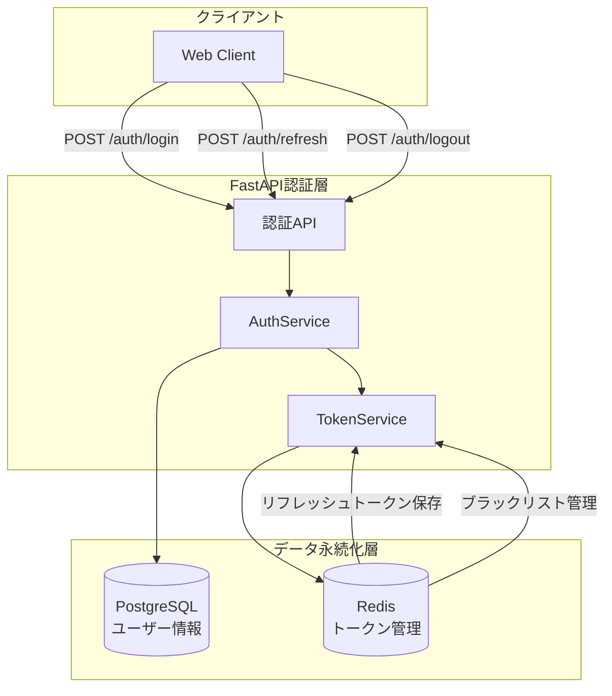
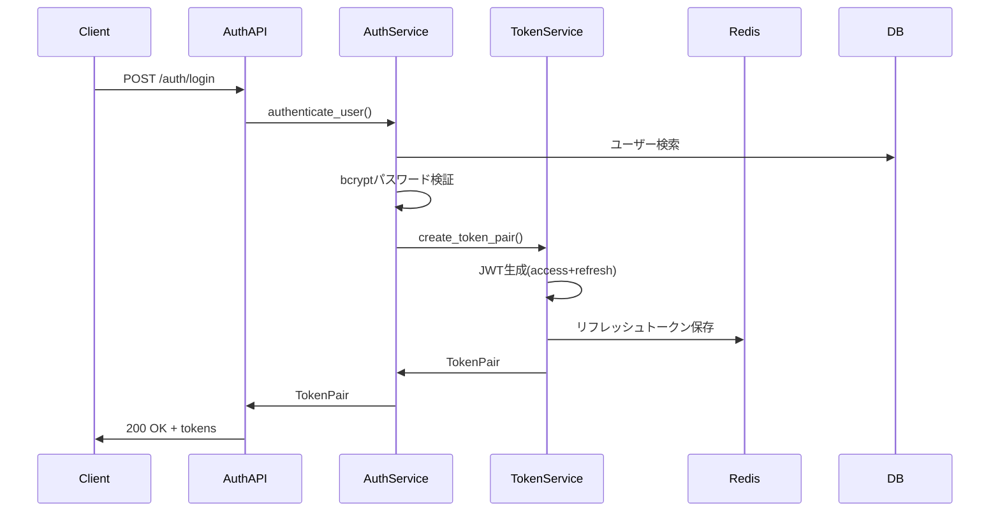
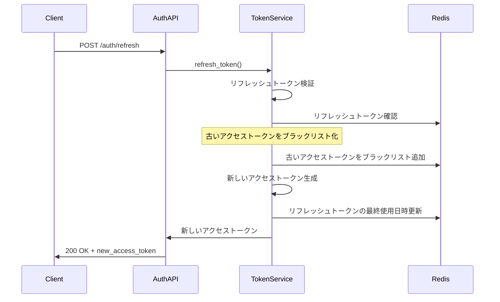
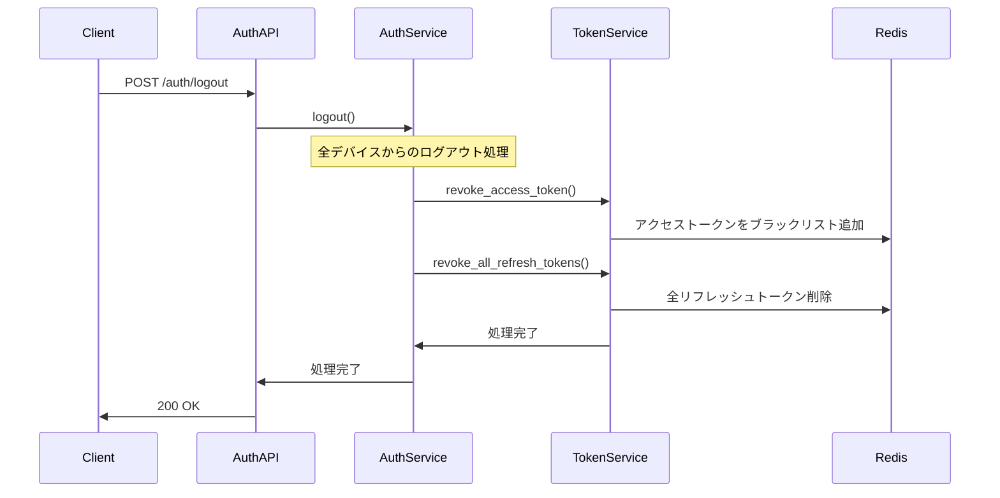

# 認証システム詳細設計書 - JWT認証フロー

## 1. アーキテクチャ概要

### 1.1 認証システム構成図



### 1.2 トークン仕様

```python
# アクセストークン仕様
ACCESS_TOKEN_EXPIRE_MINUTES = 30
ACCESS_TOKEN_PAYLOAD = {
    "sub": "user_id",           # ユーザーID
    "jti": "token_id",          # JWT ID (ブラックリスト用)
    "role": "user_role",        # ユーザーロール
    "permissions": [],          # 権限リスト
    "exp": "expiration_time",   # 有効期限
    "iat": "issued_at",         # 発行時刻
    "type": "access"            # トークンタイプ
}

# リフレッシュトークン仕様
REFRESH_TOKEN_EXPIRE_DAYS = 7
REFRESH_TOKEN_PAYLOAD = {
    "sub": "user_id",           # ユーザーID
    "jti": "token_id",          # JWT ID (Redis管理用)
    "exp": "expiration_time",   # 有効期限
    "iat": "issued_at",         # 発行時刻
    "type": "refresh"           # トークンタイプ
}
```

## 2. コンポーネント設計

### 2.1 コンポーネント一覧

| コンポーネント名 | 責務 | 依存関係 |
|-----------------|------|----------|
| AuthService | ユーザー認証、パスワード検証 | UserRepository, TokenService |
| TokenService | JWT生成・検証、Redis管理 | RedisClient, JWTHandler |
| JWTHandler | JWT生成・検証・デコード | python-jose |
| RedisTokenManager | Redisでのトークン保存・削除 | aioredis |
| AuthMiddleware | リクエスト認証・認可 | TokenService |

### 2.2 各コンポーネントの詳細

#### AuthService

- **目的**: ユーザー認証とログイン・ログアウト処理
- **公開インターフェース**:
  ```python
  class AuthService:
      async def authenticate_user(self, username: str, password: str) -> Optional[User]
      async def login(self, username: str, password: str) -> TokenPair
      async def refresh_token(self, refresh_token: str) -> TokenPair
      async def logout(self, user_id: UUID, access_token: str) -> bool
      async def logout_all_devices(self, user_id: UUID) -> bool
  ```

#### TokenService

- **目的**: JWT生成・検証とRedisでのトークン管理
- **公開インターフェース**:
  ```python
  class TokenService:
      async def create_token_pair(self, user: User) -> TokenPair
      async def verify_access_token(self, token: str) -> Optional[TokenData]
      async def verify_refresh_token(self, token: str) -> Optional[TokenData]
      async def revoke_access_token(self, token: str) -> bool
      async def revoke_all_refresh_tokens(self, user_id: UUID) -> bool
      async def is_token_blacklisted(self, jti: str) -> bool
  ```

## 3. Redis トークン管理設計

### 3.1 Redisキー設計

```python
# リフレッシュトークン保存
REFRESH_TOKEN_KEY = "refresh_token:{user_id}:{token_id}"
REFRESH_TOKEN_DATA = {
    "token": "refresh_token_string",
    "user_id": "uuid",
    "created_at": "2024-01-01T00:00:00Z",
    "last_used": "2024-01-01T00:00:00Z",
    "device_info": "optional_device_fingerprint"
}
TTL = 7 * 24 * 60 * 60  # 7日

# アクセストークンブラックリスト
BLACKLIST_KEY = "blacklist:access:{jti}"
BLACKLIST_VALUE = {
    "revoked_at": "2024-01-01T00:00:00Z",
    "reason": "refresh|logout|security"
}
TTL = remaining_token_expiration  # トークンの残り有効期限

# ユーザー別リフレッシュトークンインデックス（高速削除用）
USER_TOKENS_KEY = "user_tokens:{user_id}"
USER_TOKENS_VALUE = ["token_id1", "token_id2", ...]
TTL = 7 * 24 * 60 * 60  # 7日
```

### 3.2 Redis操作実装

```python
class RedisTokenManager:
    """Redisでのトークン管理クラス"""
    
    async def store_refresh_token(
        self, 
        user_id: UUID, 
        token_id: str, 
        token: str,
        expire_seconds: int = 604800  # 7日
    ) -> bool:
        """リフレッシュトークンをRedisに保存"""
        key = f"refresh_token:{user_id}:{token_id}"
        data = {
            "token": token,
            "user_id": str(user_id),
            "created_at": datetime.utcnow().isoformat(),
            "last_used": datetime.utcnow().isoformat()
        }
        
        async with self.redis.pipeline() as pipe:
            # リフレッシュトークン保存
            await pipe.setex(key, expire_seconds, json.dumps(data))
            
            # ユーザー別トークンインデックス更新
            user_tokens_key = f"user_tokens:{user_id}"
            await pipe.sadd(user_tokens_key, token_id)
            await pipe.expire(user_tokens_key, expire_seconds)
            
            await pipe.execute()
        
        return True
    
    async def revoke_all_user_tokens(self, user_id: UUID) -> bool:
        """ユーザーの全リフレッシュトークンを削除（全デバイスログアウト）"""
        user_tokens_key = f"user_tokens:{user_id}"
        token_ids = await self.redis.smembers(user_tokens_key)
        
        if token_ids:
            # 全リフレッシュトークンを削除
            keys_to_delete = [
                f"refresh_token:{user_id}:{token_id}" 
                for token_id in token_ids
            ]
            keys_to_delete.append(user_tokens_key)
            
            await self.redis.delete(*keys_to_delete)
        
        return True
    
    async def blacklist_access_token(
        self, 
        jti: str, 
        expire_seconds: int,
        reason: str = "logout"
    ) -> bool:
        """アクセストークンをブラックリストに追加"""
        key = f"blacklist:access:{jti}"
        data = {
            "revoked_at": datetime.utcnow().isoformat(),
            "reason": reason
        }
        
        await self.redis.setex(key, expire_seconds, json.dumps(data))
        return True
```

## 4. 認証フロー詳細

### 4.1 ログインフロー



**実装例**:
```python
async def login(self, username: str, password: str) -> TokenPair:
    # 1. ユーザー認証
    user = await self.authenticate_user(username, password)
    if not user:
        raise AuthenticationError("Invalid credentials")
    
    # 2. トークンペア生成
    token_pair = await self.token_service.create_token_pair(user)
    
    # 3. ログイン履歴記録（オプション）
    await self.log_login_event(user.id)
    
    return token_pair
```

### 4.2 トークンリフレッシュフロー



**実装例**:
```python
async def refresh_token(self, refresh_token: str, old_access_token: str) -> str:
    # 1. リフレッシュトークン検証
    token_data = await self.token_service.verify_refresh_token(refresh_token)
    if not token_data:
        raise TokenError("Invalid refresh token")
    
    # 2. 古いアクセストークンをブラックリスト化
    await self.token_service.revoke_access_token(old_access_token)
    
    # 3. 新しいアクセストークン生成
    user = await self.user_repository.get_by_id(token_data.user_id)
    new_access_token = await self.token_service.create_access_token(user)
    
    # 4. リフレッシュトークンの最終使用日時更新
    await self.token_service.update_refresh_token_usage(token_data.jti)
    
    return new_access_token
```

### 4.3 ログアウトフロー（全デバイス）



**実装例**:
```python
async def logout(self, user_id: UUID, access_token: str) -> bool:
    # 1. 現在のアクセストークンをブラックリスト化
    await self.token_service.revoke_access_token(access_token)
    
    # 2. 全デバイスのリフレッシュトークン削除
    await self.token_service.revoke_all_refresh_tokens(user_id)
    
    # 3. ログアウト履歴記録（オプション）
    await self.log_logout_event(user_id)
    
    return True
```

## 5. APIエンドポイント設計

### 5.1 認証API仕様

```python
# ログインAPI
POST /api/v1/auth/login
Content-Type: application/json

Request:
{
    "username": "user@example.com",
    "password": "password123"
}

Response (200 OK):
{
    "access_token": "eyJhbGciOiJIUzI1NiIsInR5cCI6IkpXVCJ9...",
    "refresh_token": "eyJhbGciOiJIUzI1NiIsInR5cCI6IkpXVCJ9...",
    "token_type": "bearer",
    "expires_in": 1800,  # 30分（秒）
    "user": {
        "id": "uuid",
        "username": "user@example.com",
        "role": "general",
        "is_sv": false
    }
}

# トークンリフレッシュAPI
POST /api/v1/auth/refresh
Content-Type: application/json
Authorization: Bearer {access_token}

Request:
{
    "refresh_token": "eyJhbGciOiJIUzI1NiIsInR5cCI6IkpXVCJ9..."
}

Response (200 OK):
{
    "access_token": "eyJhbGciOiJIUzI1NiIsInR5cCI6IkpXVCJ9...",
    "token_type": "bearer",
    "expires_in": 1800
}

# ログアウトAPI（全デバイス）
POST /api/v1/auth/logout
Authorization: Bearer {access_token}

Request: {}

Response (200 OK):
{
    "message": "Successfully logged out from all devices"
}
```

## 6. セキュリティ設計

### 6.1 セキュリティ考慮事項

```python
# JWT署名アルゴリズム
ALGORITHM = "HS256"  # 本番では RS256 推奨

# パスワードハッシュ化
BCRYPT_ROUNDS = 12

# セキュリティヘッダー
SECURITY_HEADERS = {
    "X-Content-Type-Options": "nosniff",
    "X-Frame-Options": "DENY",
    "X-XSS-Protection": "1; mode=block"
}
```

### 6.2 認証ミドルウェア

```python
class AuthMiddleware:
    """認証・認可ミドルウェア"""
    
    async def __call__(self, request: Request, call_next):
        # 認証が不要なパスは素通し
        if request.url.path in ["/auth/login", "/health"]:
            return await call_next(request)
        
        # Authorizationヘッダー確認
        auth_header = request.headers.get("Authorization")
        if not auth_header or not auth_header.startswith("Bearer "):
            raise HTTPException(401, "Missing or invalid authorization header")
        
        # トークン検証
        token = auth_header.split(" ")[1]
        token_data = await self.token_service.verify_access_token(token)
        
        if not token_data:
            raise HTTPException(401, "Invalid or expired token")
        
        # ブラックリスト確認
        if await self.token_service.is_token_blacklisted(token_data.jti):
            raise HTTPException(401, "Token has been revoked")
        
        # リクエストにユーザー情報を追加
        request.state.user = token_data
        
        return await call_next(request)
```

## 7. エラーハンドリング

### 7.1 認証エラー分類

```python
class AuthenticationError(Exception):
    """認証失敗エラー (401)"""
    pass

class TokenError(Exception):
    """トークン関連エラー (401)"""
    pass

class TokenExpiredError(TokenError):
    """トークン期限切れエラー (401)"""
    pass

class TokenRevokedError(TokenError):
    """トークン無効化エラー (401)"""
    pass
```

### 7.2 エラーレスポンス形式

```python
# 認証エラーレスポンス例
HTTP/1.1 401 Unauthorized
Content-Type: application/json

{
    "error": "authentication_failed",
    "message": "Invalid credentials",
    "code": 40001,
    "timestamp": "2024-01-01T00:00:00Z"
}

# トークン期限切れエラー
{
    "error": "token_expired", 
    "message": "Access token has expired",
    "code": 40002,
    "timestamp": "2024-01-01T00:00:00Z"
}
```

## 8. テスト戦略

### 8.1 単体テスト項目

```python
# AuthService テスト
- test_authenticate_user_success()
- test_authenticate_user_invalid_password()
- test_login_success()
- test_logout_all_devices()

# TokenService テスト  
- test_create_token_pair()
- test_verify_access_token()
- test_verify_refresh_token()
- test_revoke_access_token()
- test_blacklist_check()

# RedisTokenManager テスト
- test_store_refresh_token()
- test_revoke_all_user_tokens()
- test_blacklist_access_token()
```

### 8.2 統合テスト項目

```python
# 認証フローテスト
- test_full_login_flow()
- test_token_refresh_flow()
- test_logout_all_devices_flow()
- test_blacklisted_token_rejection()
- test_expired_token_handling()
```

## 9. 実装上の注意事項

### 9.1 Redis接続管理
```python
# Redis接続プール設定
REDIS_CONFIG = {
    "host": "localhost",
    "port": 6379,
    "db": 0,
    "max_connections": 20,
    "retry_on_timeout": True,
    "socket_timeout": 5.0
}
```

### 9.2 JWT設定
```python
# JWT設定
JWT_CONFIG = {
    "algorithm": "HS256",
    "secret_key": os.getenv("JWT_SECRET_KEY"),
    "access_token_expire_minutes": 30,
    "refresh_token_expire_days": 7
}
```

### 9.3 パフォーマンス考慮事項
- Redis操作は可能な限りパイプライン使用
- JWTの検証結果は短時間キャッシュ（メモリ）
- ブラックリストチェックはRedisのキー存在確認のみ

この設計で認証フローの実装を進めて問題ないでしょうか？他に検討したい点があれば教えてください！