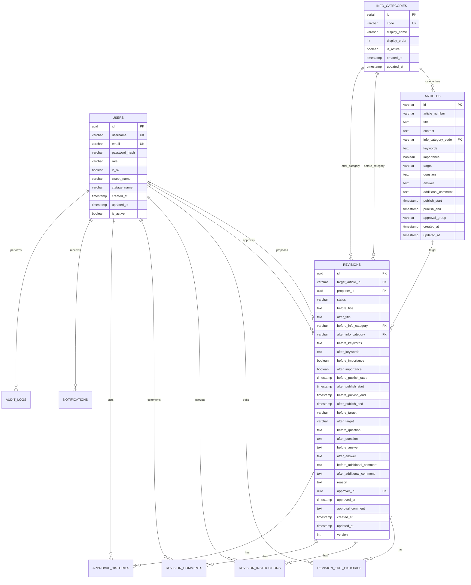

# データベース設計書 - 既存ナレッジ修正案管理システム

## 1. 設計概要

### 1.1 データベース仕様
- **DBMS**: PostgreSQL 16+
- **文字エンコーディング**: UTF-8
- **タイムゾーン**: UTC
- **接続方式**: 非同期（asyncpg 0.30.0）
- **ORM**: SQLAlchemy 2.0.40

### 1.2 命名規則
- **テーブル名**: 複数形スネークケース（例: `users`, `revision_histories`）
- **カラム名**: スネークケース（例: `user_id`, `created_at`）
- **インデックス名**: `idx_{table}_{column(s)}`
- **外部キー制約名**: `fk_{table}_{reference_table}_{column}`

## 2. ER図



## 3. テーブル定義

### 3.1 ユーザー管理

#### users テーブル
```sql
CREATE TABLE users (
    id UUID PRIMARY KEY DEFAULT gen_random_uuid(),
    username VARCHAR(100) UNIQUE NOT NULL,
    email VARCHAR(255) UNIQUE NOT NULL,
    password_hash VARCHAR(255) NOT NULL,
    role VARCHAR(20) NOT NULL DEFAULT 'general',
    is_sv BOOLEAN NOT NULL DEFAULT FALSE,
    sweet_name VARCHAR(100),                    -- 将来的なSweet連携用
    ctstage_name VARCHAR(100),                 -- 将来的なCtstage連携用
    created_at TIMESTAMP NOT NULL DEFAULT CURRENT_TIMESTAMP,
    updated_at TIMESTAMP NOT NULL DEFAULT CURRENT_TIMESTAMP,
    is_active BOOLEAN NOT NULL DEFAULT TRUE,
    
    CONSTRAINT chk_users_role CHECK (role IN ('general', 'supervisor', 'approver', 'admin')),
    CONSTRAINT chk_users_username_length CHECK (char_length(username) >= 3),
    CONSTRAINT chk_users_email_format CHECK (email ~* '^[A-Za-z0-9._%+-]+@[A-Za-z0-9.-]+\.[A-Za-z]{2,}$')
);

-- インデックス
CREATE INDEX idx_users_role ON users(role);
CREATE INDEX idx_users_is_sv ON users(is_sv);
CREATE INDEX idx_users_is_active ON users(is_active);
CREATE INDEX idx_users_created_at ON users(created_at);

-- コメント
COMMENT ON TABLE users IS 'ユーザー情報テーブル';
COMMENT ON COLUMN users.role IS 'ユーザーロール: general, supervisor, approver, admin';
COMMENT ON COLUMN users.is_sv IS 'スーパーバイザー権限フラグ';
COMMENT ON COLUMN users.sweet_name IS 'Sweet連携用ユーザー名（将来拡張用）';
COMMENT ON COLUMN users.ctstage_name IS 'Ctstage連携用ユーザー名（将来拡張用）';
```

### 3.2 記事管理

#### info_categories テーブル
```sql
CREATE TABLE info_categories (
    id SERIAL PRIMARY KEY,
    code VARCHAR(2) UNIQUE NOT NULL,
    display_name VARCHAR(100) NOT NULL,
    display_order INTEGER NOT NULL,
    is_active BOOLEAN NOT NULL DEFAULT TRUE,
    created_at TIMESTAMP NOT NULL DEFAULT CURRENT_TIMESTAMP,
    updated_at TIMESTAMP NOT NULL DEFAULT CURRENT_TIMESTAMP,
    
    CONSTRAINT chk_info_categories_code_format CHECK (code ~ '^[0-9]{2}$'),
    CONSTRAINT chk_info_categories_display_order_positive CHECK (display_order > 0)
);

-- インデックス
CREATE INDEX idx_info_categories_is_active ON info_categories(is_active);
CREATE INDEX idx_info_categories_display_order ON info_categories(display_order);

-- 初期データ投入
INSERT INTO info_categories (code, display_name, display_order) VALUES
('01', '_会計・財務', 1),
('02', '_起動トラブル', 2),
('03', '_給与・年末調整', 3),
('04', '_減価・ﾘｰｽ/資産管理', 4),
('05', '_公益・医療会計', 5),
('06', '_工事・原価', 6),
('07', '_債権・債務', 7),
('08', '_事務所管理', 8),
('09', '_人事', 9),
('10', '_税務関連', 10),
('11', '_電子申告', 11),
('12', '_販売', 12),
('13', 'EdgeTracker', 13),
('14', 'MJS-Connect関連', 14),
('15', 'インストール・MOU', 15),
('16', 'かんたん！シリーズ', 16),
('17', 'その他（システム以外）', 17),
('18', 'その他MJSシステム', 18),
('19', 'その他システム（共通）', 19),
('20', 'ハード関連(HHD)', 20),
('21', 'ハード関連（ソフトフェア）', 21),
('22', 'マイナンバー', 22),
('23', 'ワークフロー', 23),
('24', '一時受付用', 24),
('25', '運用ルール', 25),
('26', '顧客情報', 26);

COMMENT ON TABLE info_categories IS '情報カテゴリマスターテーブル';
COMMENT ON COLUMN info_categories.code IS 'カテゴリコード（2桁数字）';
```

#### articles テーブル
```sql
CREATE TABLE articles (
    id VARCHAR(50) PRIMARY KEY,
    article_number VARCHAR(100) NOT NULL,
    title TEXT NOT NULL,
    content TEXT,
    info_category_code VARCHAR(2) REFERENCES info_categories(code),
    keywords TEXT,
    importance BOOLEAN NOT NULL DEFAULT FALSE,
    target VARCHAR(20) NOT NULL DEFAULT '社内',
    question TEXT,
    answer TEXT,
    additional_comment TEXT,
    publish_start TIMESTAMP,
    publish_end TIMESTAMP,
    approval_group VARCHAR(100),
    created_at TIMESTAMP NOT NULL DEFAULT CURRENT_TIMESTAMP,
    updated_at TIMESTAMP NOT NULL DEFAULT CURRENT_TIMESTAMP,
    
    CONSTRAINT chk_articles_target CHECK (target IN ('社内', '社外', '対象外')),
    CONSTRAINT chk_articles_title_not_empty CHECK (char_length(trim(title)) > 0)
);

-- インデックス（検索性能向上）
CREATE INDEX idx_articles_info_category ON articles(info_category_code);
CREATE INDEX idx_articles_importance ON articles(importance);
CREATE INDEX idx_articles_target ON articles(target);
CREATE INDEX idx_articles_article_number ON articles(article_number);
CREATE INDEX idx_articles_created_at ON articles(created_at);

-- 全文検索用インデックス
CREATE INDEX idx_articles_title_gin ON articles USING gin(to_tsvector('japanese', title));
CREATE INDEX idx_articles_content_gin ON articles USING gin(to_tsvector('japanese', content));
CREATE INDEX idx_articles_keywords_gin ON articles USING gin(to_tsvector('japanese', keywords));

COMMENT ON TABLE articles IS '既存記事テーブル（参照専用）';
COMMENT ON COLUMN articles.target IS '対象者分類: 社内, 社外, 対象外';
COMMENT ON COLUMN articles.importance IS '重要度フラグ: true=重要, false=一般';
```

### 3.3 修正案管理

#### revisions テーブル
```sql
CREATE TABLE revisions (
    id UUID PRIMARY KEY DEFAULT gen_random_uuid(),
    target_article_id VARCHAR(50) NOT NULL REFERENCES articles(id),
    proposer_id UUID NOT NULL REFERENCES users(id),
    status VARCHAR(20) NOT NULL DEFAULT 'draft',
    
    -- 修正前後のフィールド（nullable）
    before_title TEXT,
    after_title TEXT,
    before_info_category VARCHAR(2) REFERENCES info_categories(code),
    after_info_category VARCHAR(2) REFERENCES info_categories(code),
    before_keywords TEXT,
    after_keywords TEXT,
    before_importance BOOLEAN,
    after_importance BOOLEAN,
    before_publish_start TIMESTAMP,
    after_publish_start TIMESTAMP,
    before_publish_end TIMESTAMP,
    after_publish_end TIMESTAMP,
    before_target VARCHAR(20),
    after_target VARCHAR(20),
    before_question TEXT,
    after_question TEXT,
    before_answer TEXT,
    after_answer TEXT,
    before_additional_comment TEXT,
    after_additional_comment TEXT,
    
    -- 修正案メタデータ
    reason TEXT NOT NULL,
    approver_id UUID REFERENCES users(id),
    approved_at TIMESTAMP,
    approval_comment TEXT,
    
    -- システムフィールド
    created_at TIMESTAMP NOT NULL DEFAULT CURRENT_TIMESTAMP,
    updated_at TIMESTAMP NOT NULL DEFAULT CURRENT_TIMESTAMP,
    version INTEGER NOT NULL DEFAULT 1,
    
    CONSTRAINT chk_revisions_status CHECK (status IN ('draft', 'under_review', 'revision_requested', 'approved', 'rejected', 'withdrawn')),
    CONSTRAINT chk_revisions_before_target CHECK (before_target IS NULL OR before_target IN ('社内', '社外', '対象外')),
    CONSTRAINT chk_revisions_after_target CHECK (after_target IS NULL OR after_target IN ('社内', '社外', '対象外')),
    CONSTRAINT chk_revisions_reason_not_empty CHECK (char_length(trim(reason)) >= 10),
    CONSTRAINT chk_revisions_approval_consistency CHECK (
        (status = 'approved' AND approver_id IS NOT NULL AND approved_at IS NOT NULL) OR
        (status != 'approved' AND (approver_id IS NULL OR approved_at IS NULL))
    )
);

-- インデックス
CREATE INDEX idx_revisions_target_article ON revisions(target_article_id);
CREATE INDEX idx_revisions_proposer ON revisions(proposer_id);
CREATE INDEX idx_revisions_approver ON revisions(approver_id);
CREATE INDEX idx_revisions_status ON revisions(status);
CREATE INDEX idx_revisions_created_at ON revisions(created_at);
CREATE INDEX idx_revisions_approved_at ON revisions(approved_at);

-- 複合インデックス
CREATE INDEX idx_revisions_status_proposer ON revisions(status, proposer_id);
CREATE INDEX idx_revisions_status_created ON revisions(status, created_at);

COMMENT ON TABLE revisions IS '修正案テーブル';
COMMENT ON COLUMN revisions.status IS 'ステータス: draft, under_review, revision_requested, approved, rejected, withdrawn';
COMMENT ON COLUMN revisions.version IS '楽観的ロック用バージョン番号';
```

#### revision_edit_histories テーブル
```sql
CREATE TABLE revision_edit_histories (
    id UUID PRIMARY KEY DEFAULT gen_random_uuid(),
    revision_id UUID NOT NULL REFERENCES revisions(id) ON DELETE CASCADE,
    editor_id UUID NOT NULL REFERENCES users(id),
    editor_role VARCHAR(20) NOT NULL,
    edited_at TIMESTAMP NOT NULL DEFAULT CURRENT_TIMESTAMP,
    changes JSONB NOT NULL,
    comment TEXT,
    version_before INTEGER NOT NULL,
    version_after INTEGER NOT NULL,
    
    CONSTRAINT chk_revision_edit_histories_editor_role CHECK (editor_role IN ('general', 'supervisor', 'approver', 'admin')),
    CONSTRAINT chk_revision_edit_histories_version_increment CHECK (version_after = version_before + 1)
);

-- インデックス
CREATE INDEX idx_revision_edit_histories_revision ON revision_edit_histories(revision_id);
CREATE INDEX idx_revision_edit_histories_editor ON revision_edit_histories(editor_id);
CREATE INDEX idx_revision_edit_histories_edited_at ON revision_edit_histories(edited_at);

-- JSONB用インデックス
CREATE INDEX idx_revision_edit_histories_changes_gin ON revision_edit_histories USING gin(changes);

COMMENT ON TABLE revision_edit_histories IS '修正案編集履歴テーブル';
COMMENT ON COLUMN revision_edit_histories.changes IS '変更内容の詳細（JSON形式）';
```

#### revision_instructions テーブル
```sql
CREATE TABLE revision_instructions (
    id UUID PRIMARY KEY DEFAULT gen_random_uuid(),
    revision_id UUID NOT NULL REFERENCES revisions(id) ON DELETE CASCADE,
    instructor_id UUID NOT NULL REFERENCES users(id),
    instruction_text TEXT NOT NULL,
    required_fields TEXT[],
    priority VARCHAR(10) NOT NULL DEFAULT 'normal',
    due_date TIMESTAMP,
    created_at TIMESTAMP NOT NULL DEFAULT CURRENT_TIMESTAMP,
    resolved_at TIMESTAMP,
    resolution_comment TEXT,
    
    CONSTRAINT chk_revision_instructions_priority CHECK (priority IN ('low', 'normal', 'high', 'urgent')),
    CONSTRAINT chk_revision_instructions_text_not_empty CHECK (char_length(trim(instruction_text)) > 0),
    CONSTRAINT chk_revision_instructions_due_date_future CHECK (due_date IS NULL OR due_date > created_at)
);

-- インデックス
CREATE INDEX idx_revision_instructions_revision ON revision_instructions(revision_id);
CREATE INDEX idx_revision_instructions_instructor ON revision_instructions(instructor_id);
CREATE INDEX idx_revision_instructions_priority ON revision_instructions(priority);
CREATE INDEX idx_revision_instructions_due_date ON revision_instructions(due_date);
CREATE INDEX idx_revision_instructions_resolved_at ON revision_instructions(resolved_at);

COMMENT ON TABLE revision_instructions IS '修正指示テーブル';
COMMENT ON COLUMN revision_instructions.required_fields IS '修正が必要なフィールドのリスト';
```

#### revision_comments テーブル
```sql
CREATE TABLE revision_comments (
    id UUID PRIMARY KEY DEFAULT gen_random_uuid(),
    revision_id UUID NOT NULL REFERENCES revisions(id) ON DELETE CASCADE,
    commenter_id UUID NOT NULL REFERENCES users(id),
    comment_text TEXT NOT NULL,
    comment_type VARCHAR(20) NOT NULL DEFAULT 'feedback',
    parent_comment_id UUID REFERENCES revision_comments(id),
    created_at TIMESTAMP NOT NULL DEFAULT CURRENT_TIMESTAMP,
    updated_at TIMESTAMP NOT NULL DEFAULT CURRENT_TIMESTAMP,
    is_deleted BOOLEAN NOT NULL DEFAULT FALSE,
    
    CONSTRAINT chk_revision_comments_type CHECK (comment_type IN ('feedback', 'question', 'answer', 'approval', 'rejection')),
    CONSTRAINT chk_revision_comments_text_not_empty CHECK (char_length(trim(comment_text)) > 0)
);

-- インデックス
CREATE INDEX idx_revision_comments_revision ON revision_comments(revision_id);
CREATE INDEX idx_revision_comments_commenter ON revision_comments(commenter_id);
CREATE INDEX idx_revision_comments_parent ON revision_comments(parent_comment_id);
CREATE INDEX idx_revision_comments_created_at ON revision_comments(created_at);
CREATE INDEX idx_revision_comments_is_deleted ON revision_comments(is_deleted);

COMMENT ON TABLE revision_comments IS '修正案コメント・フィードバックテーブル';
COMMENT ON COLUMN revision_comments.comment_type IS 'コメント種別: feedback, question, answer, approval, rejection';
```

### 3.4 承認ワークフロー

#### approval_histories テーブル
```sql
CREATE TABLE approval_histories (
    id UUID PRIMARY KEY DEFAULT gen_random_uuid(),
    revision_id UUID NOT NULL REFERENCES revisions(id) ON DELETE CASCADE,
    actor_id UUID NOT NULL REFERENCES users(id),
    action VARCHAR(20) NOT NULL,
    comment TEXT,
    created_at TIMESTAMP NOT NULL DEFAULT CURRENT_TIMESTAMP,
    metadata JSONB,
    
    CONSTRAINT chk_approval_histories_action CHECK (action IN ('submitted', 'approved', 'rejected', 'revision_requested', 'withdrawn'))
);

-- インデックス
CREATE INDEX idx_approval_histories_revision ON approval_histories(revision_id);
CREATE INDEX idx_approval_histories_actor ON approval_histories(actor_id);
CREATE INDEX idx_approval_histories_action ON approval_histories(action);
CREATE INDEX idx_approval_histories_created_at ON approval_histories(created_at);

COMMENT ON TABLE approval_histories IS '承認履歴テーブル';
COMMENT ON COLUMN approval_histories.action IS 'アクション: submitted, approved, rejected, revision_requested, withdrawn';
```

### 3.5 通知システム

#### notifications テーブル
```sql
CREATE TABLE notifications (
    id UUID PRIMARY KEY DEFAULT gen_random_uuid(),
    recipient_id UUID NOT NULL REFERENCES users(id),
    notification_type VARCHAR(50) NOT NULL,
    title VARCHAR(200) NOT NULL,
    content TEXT NOT NULL,
    metadata JSONB,
    is_read BOOLEAN NOT NULL DEFAULT FALSE,
    read_at TIMESTAMP,
    created_at TIMESTAMP NOT NULL DEFAULT CURRENT_TIMESTAMP,
    expires_at TIMESTAMP,
    
    CONSTRAINT chk_notifications_read_consistency CHECK (
        (is_read = TRUE AND read_at IS NOT NULL) OR
        (is_read = FALSE AND read_at IS NULL)
    ),
    CONSTRAINT chk_notifications_expires_future CHECK (expires_at IS NULL OR expires_at > created_at)
);

-- インデックス
CREATE INDEX idx_notifications_recipient ON notifications(recipient_id);
CREATE INDEX idx_notifications_is_read ON notifications(is_read);
CREATE INDEX idx_notifications_created_at ON notifications(created_at);
CREATE INDEX idx_notifications_expires_at ON notifications(expires_at);

-- 複合インデックス
CREATE INDEX idx_notifications_recipient_read ON notifications(recipient_id, is_read);

COMMENT ON TABLE notifications IS '通知テーブル';
COMMENT ON COLUMN notifications.notification_type IS '通知種別: revision_created, revision_approved, revision_rejected, etc.';
```

### 3.6 監査ログ

#### audit_logs テーブル
```sql
CREATE TABLE audit_logs (
    id UUID PRIMARY KEY DEFAULT gen_random_uuid(),
    user_id UUID REFERENCES users(id),
    action VARCHAR(100) NOT NULL,
    resource_type VARCHAR(50) NOT NULL,
    resource_id VARCHAR(100) NOT NULL,
    details JSONB,
    ip_address INET,
    user_agent TEXT,
    created_at TIMESTAMP NOT NULL DEFAULT CURRENT_TIMESTAMP,
    
    CONSTRAINT chk_audit_logs_action_not_empty CHECK (char_length(trim(action)) > 0),
    CONSTRAINT chk_audit_logs_resource_type_not_empty CHECK (char_length(trim(resource_type)) > 0)
);

-- インデックス
CREATE INDEX idx_audit_logs_user ON audit_logs(user_id);
CREATE INDEX idx_audit_logs_action ON audit_logs(action);
CREATE INDEX idx_audit_logs_resource_type ON audit_logs(resource_type);
CREATE INDEX idx_audit_logs_resource_id ON audit_logs(resource_id);
CREATE INDEX idx_audit_logs_created_at ON audit_logs(created_at);

-- 複合インデックス
CREATE INDEX idx_audit_logs_resource ON audit_logs(resource_type, resource_id);

COMMENT ON TABLE audit_logs IS '監査ログテーブル';
COMMENT ON COLUMN audit_logs.resource_type IS 'リソースタイプ: user, article, revision, etc.';
```

## 4. ビューの定義

### 4.1 修正案サマリービュー
```sql
CREATE VIEW revision_summaries AS
SELECT 
    r.id,
    r.target_article_id,
    a.title AS article_title,
    a.article_number,
    r.status,
    u_proposer.username AS proposer_username,
    u_approver.username AS approver_username,
    r.reason,
    r.created_at,
    r.updated_at,
    r.approved_at,
    -- 変更フィールド数のカウント
    (
        CASE WHEN r.after_title IS NOT NULL THEN 1 ELSE 0 END +
        CASE WHEN r.after_info_category IS NOT NULL THEN 1 ELSE 0 END +
        CASE WHEN r.after_keywords IS NOT NULL THEN 1 ELSE 0 END +
        CASE WHEN r.after_importance IS NOT NULL THEN 1 ELSE 0 END +
        CASE WHEN r.after_publish_start IS NOT NULL THEN 1 ELSE 0 END +
        CASE WHEN r.after_publish_end IS NOT NULL THEN 1 ELSE 0 END +
        CASE WHEN r.after_target IS NOT NULL THEN 1 ELSE 0 END +
        CASE WHEN r.after_question IS NOT NULL THEN 1 ELSE 0 END +
        CASE WHEN r.after_answer IS NOT NULL THEN 1 ELSE 0 END +
        CASE WHEN r.after_additional_comment IS NOT NULL THEN 1 ELSE 0 END
    ) AS changed_fields_count
FROM revisions r
JOIN articles a ON r.target_article_id = a.id
JOIN users u_proposer ON r.proposer_id = u_proposer.id
LEFT JOIN users u_approver ON r.approver_id = u_approver.id;

COMMENT ON VIEW revision_summaries IS '修正案サマリービュー（一覧表示用）';
```

### 4.2 アクティブユーザービュー
```sql
CREATE VIEW active_users AS
SELECT 
    id,
    username,
    email,
    role,
    is_sv,
    created_at,
    updated_at
FROM users 
WHERE is_active = TRUE;

COMMENT ON VIEW active_users IS 'アクティブユーザービュー';
```

## 5. トリガー関数

### 5.1 updated_at自動更新トリガー
```sql
-- トリガー関数の作成
CREATE OR REPLACE FUNCTION update_updated_at_column()
RETURNS TRIGGER AS $$
BEGIN
    NEW.updated_at = CURRENT_TIMESTAMP;
    RETURN NEW;
END;
$$ language 'plpgsql';

-- 各テーブルにトリガーを設定
CREATE TRIGGER update_users_updated_at 
    BEFORE UPDATE ON users 
    FOR EACH ROW EXECUTE FUNCTION update_updated_at_column();

CREATE TRIGGER update_articles_updated_at 
    BEFORE UPDATE ON articles 
    FOR EACH ROW EXECUTE FUNCTION update_updated_at_column();

CREATE TRIGGER update_info_categories_updated_at 
    BEFORE UPDATE ON info_categories 
    FOR EACH ROW EXECUTE FUNCTION update_updated_at_column();

CREATE TRIGGER update_revisions_updated_at 
    BEFORE UPDATE ON revisions 
    FOR EACH ROW EXECUTE FUNCTION update_updated_at_column();

CREATE TRIGGER update_revision_comments_updated_at 
    BEFORE UPDATE ON revision_comments 
    FOR EACH ROW EXECUTE FUNCTION update_updated_at_column();
```

### 5.2 修正案バージョン管理トリガー
```sql
-- 修正案の更新時にバージョンを自動インクリメント
CREATE OR REPLACE FUNCTION increment_revision_version()
RETURNS TRIGGER AS $$
BEGIN
    -- ステータス以外の変更の場合はバージョンをインクリメント
    IF (OLD.before_title IS DISTINCT FROM NEW.before_title OR
        OLD.after_title IS DISTINCT FROM NEW.after_title OR
        OLD.before_info_category IS DISTINCT FROM NEW.before_info_category OR
        OLD.after_info_category IS DISTINCT FROM NEW.after_info_category OR
        OLD.before_keywords IS DISTINCT FROM NEW.before_keywords OR
        OLD.after_keywords IS DISTINCT FROM NEW.after_keywords OR
        OLD.before_importance IS DISTINCT FROM NEW.before_importance OR
        OLD.after_importance IS DISTINCT FROM NEW.after_importance OR
        OLD.before_publish_start IS DISTINCT FROM NEW.before_publish_start OR
        OLD.after_publish_start IS DISTINCT FROM NEW.after_publish_start OR
        OLD.before_publish_end IS DISTINCT FROM NEW.before_publish_end OR
        OLD.after_publish_end IS DISTINCT FROM NEW.after_publish_end OR
        OLD.before_target IS DISTINCT FROM NEW.before_target OR
        OLD.after_target IS DISTINCT FROM NEW.after_target OR
        OLD.before_question IS DISTINCT FROM NEW.before_question OR
        OLD.after_question IS DISTINCT FROM NEW.after_question OR
        OLD.before_answer IS DISTINCT FROM NEW.before_answer OR
        OLD.after_answer IS DISTINCT FROM NEW.after_answer OR
        OLD.before_additional_comment IS DISTINCT FROM NEW.before_additional_comment OR
        OLD.after_additional_comment IS DISTINCT FROM NEW.after_additional_comment OR
        OLD.reason IS DISTINCT FROM NEW.reason) THEN
        
        NEW.version = OLD.version + 1;
    END IF;
    
    RETURN NEW;
END;
$$ language 'plpgsql';

CREATE TRIGGER increment_revision_version_trigger
    BEFORE UPDATE ON revisions
    FOR EACH ROW EXECUTE FUNCTION increment_revision_version();
```

## 6. インデックス設計戦略

### 6.1 パフォーマンス重視インデックス
```sql
-- よく使用される検索条件用の複合インデックス
CREATE INDEX idx_revisions_proposer_status_created ON revisions(proposer_id, status, created_at DESC);
CREATE INDEX idx_revisions_article_status ON revisions(target_article_id, status);
CREATE INDEX idx_articles_category_importance ON articles(info_category_code, importance);

-- 全文検索パフォーマンス向上
CREATE INDEX idx_articles_search_vector ON articles USING gin(
    to_tsvector('japanese', coalesce(title, '') || ' ' || coalesce(content, '') || ' ' || coalesce(keywords, ''))
);
```

### 6.2 統計情報の定期更新
```sql
-- 統計情報を定期的に更新するための設定
ALTER TABLE revisions SET (autovacuum_analyze_scale_factor = 0.05);
ALTER TABLE articles SET (autovacuum_analyze_scale_factor = 0.1);
```

## 7. セキュリティ設定

### 7.1 行レベルセキュリティ（RLS）
```sql
-- 修正案の行レベルセキュリティ
ALTER TABLE revisions ENABLE ROW LEVEL SECURITY;

-- 提案者は自分の修正案のみ参照可能（draft状態）
CREATE POLICY revision_proposer_policy ON revisions
    FOR ALL TO application_role
    USING (
        proposer_id = current_setting('app.current_user_id')::uuid 
        OR status != 'draft'
        OR current_setting('app.current_user_role') IN ('admin', 'supervisor', 'approver')
    );
```

### 7.2 データベースロール設定
```sql
-- アプリケーション用ロール
CREATE ROLE app_user WITH LOGIN PASSWORD 'secure_password';
GRANT CONNECT ON DATABASE knowledge_revision_system TO app_user;
GRANT USAGE ON SCHEMA public TO app_user;

-- テーブルへの権限付与
GRANT SELECT, INSERT, UPDATE, DELETE ON ALL TABLES IN SCHEMA public TO app_user;
GRANT USAGE, SELECT ON ALL SEQUENCES IN SCHEMA public TO app_user;

-- 読み取り専用ロール（レポート用）
CREATE ROLE app_reader WITH LOGIN PASSWORD 'reader_password';
GRANT CONNECT ON DATABASE knowledge_revision_system TO app_reader;
GRANT USAGE ON SCHEMA public TO app_reader;
GRANT SELECT ON ALL TABLES IN SCHEMA public TO app_reader;
```

## 8. バックアップ・リカバリ戦略

### 8.1 バックアップ設定
```sql
-- WALアーカイブの設定
-- postgresql.conf:
-- wal_level = replica
-- archive_mode = on
-- archive_command = 'cp %p /var/lib/postgresql/archive/%f'

-- ポイントインタイムリカバリ用の設定
-- recovery.conf (必要時):
-- restore_command = 'cp /var/lib/postgresql/archive/%f %p'
-- recovery_target_time = '2024-01-01 12:00:00'
```

### 8.2 論理バックアップ
```bash
# 日次フルバックアップ
pg_dump -h localhost -U postgres -W -F c knowledge_revision_system > backup_$(date +%Y%m%d).dump

# テーブル別バックアップ（重要データ）
pg_dump -h localhost -U postgres -W -t revisions -t users knowledge_revision_system > critical_backup_$(date +%Y%m%d).sql
```

## 9. パフォーマンス監視

### 9.1 スロークエリ監視
```sql
-- スロークエリログの設定
-- postgresql.conf:
-- log_min_duration_statement = 1000  -- 1秒以上のクエリをログ
-- log_statement = 'all'
-- log_line_prefix = '%t [%p]: [%l-1] user=%u,db=%d,app=%a,client=%h '

-- よく実行されるクエリの統計
SELECT 
    query,
    calls,
    total_time,
    mean_time,
    rows
FROM pg_stat_statements 
ORDER BY total_time DESC 
LIMIT 10;
```

### 9.2 インデックス使用状況監視
```sql
-- 使用されていないインデックスの検出
SELECT 
    schemaname,
    tablename,
    indexname,
    idx_tup_read,
    idx_tup_fetch
FROM pg_stat_user_indexes 
WHERE idx_tup_read = 0 
AND idx_tup_fetch = 0;

-- テーブルスキャンが多いテーブルの検出
SELECT 
    schemaname,
    tablename,
    seq_scan,
    seq_tup_read,
    idx_scan,
    idx_tup_fetch
FROM pg_stat_user_tables 
WHERE seq_scan > idx_scan 
ORDER BY seq_tup_read DESC;
```

## 10. 初期データとサンプルデータ

### 10.1 管理者ユーザー作成
```sql
-- 初期管理者ユーザー（パスワードは実装時に適切にハッシュ化）
INSERT INTO users (username, email, password_hash, role, is_sv) VALUES
('admin', 'admin@example.com', '$2b$12$...', 'admin', false),
('supervisor', 'supervisor@example.com', '$2b$12$...', 'supervisor', true),
('approver', 'approver@example.com', '$2b$12$...', 'approver', false);
```

### 10.2 サンプル記事データ
```sql
-- サンプル記事（テスト用）
INSERT INTO articles (id, article_number, title, content, info_category_code, importance, target) VALUES
('ART001', 'KB-001', '会計システムの使い方', '会計システムの基本的な使用方法について説明します。', '01', false, '社内'),
('ART002', 'KB-002', 'システム起動時のトラブルシューティング', 'システムが起動しない場合の対処法をまとめました。', '02', true, '社内'),
('ART003', 'KB-003', '給与計算の手順', '月次給与計算の詳細な手順について解説します。', '03', true, '社内');
```

この設計により、要件定義書で求められている全ての機能を適切にサポートできるデータベース構造が完成します。